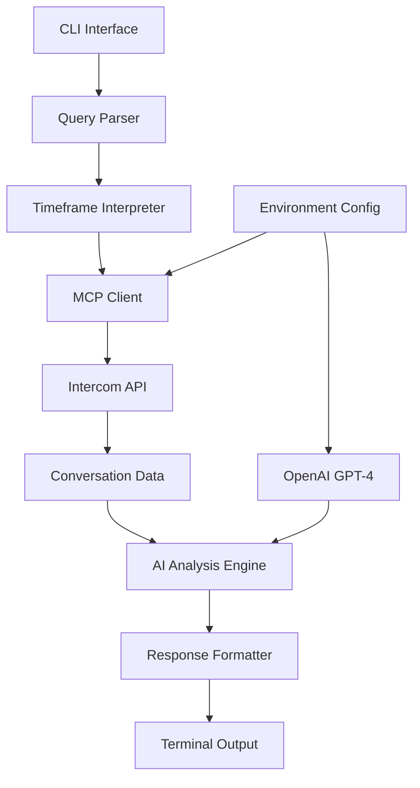

# Phase 0 Architecture: Core Intelligence Proof

> **Goal:** Prove the AI + MCP integration can answer one question well
> **Timeline:** Week 1-2
> **Success Criteria:** CLI answers "What are the top customer complaints this month?" in <10s, <$0.50, with coherent 3-5 bullet summary

---

## System Overview



## Component Architecture

### 1. Entry Point: CLI Interface
**File:** `cli.py`
**Responsibility:** Argument parsing, environment setup, orchestration

```python
# Key interfaces
def main(query: str, debug: bool = False) -> None
def parse_args() -> argparse.Namespace
def setup_logging(debug: bool) -> None
```

**Dependencies:**
- `argparse` for command-line interface
- `python-dotenv` for environment configuration
- Standard logging module

### 2. Core: Query Processor
**File:** `query_processor.py`
**Responsibility:** Coordinate the full query workflow

```python
class QueryProcessor:
    def __init__(self, intercom_client, ai_client)
    async def process_query(self, query: str) -> QueryResult
    def _parse_timeframe(self, query: str) -> TimeFrame
    def _format_response(self, analysis: str) -> str
```

**Key workflow:**
1. Parse natural language query for time context
2. Convert to specific date ranges
3. Fetch relevant conversations via MCP
4. Send to AI for analysis
5. Format and return results

### 3. Data Layer: Intercom MCP Client
**File:** `intercom_client.py`
**Responsibility:** Manage MCP connection and data fetching

```python
class IntercomMCPClient:
    def __init__(self, access_token: str)
    async def connect(self) -> None
    async def fetch_conversations(self, filters: ConversationFilters) -> List[Conversation]
    async def disconnect(self) -> None
```

**Key features:**
- MCP protocol integration for efficient data access
- Date-based filtering for timeframe queries
- Conversation threading and context preservation
- Fallback to REST API if MCP fails

### 4. Intelligence: AI Analysis Engine
**File:** `ai_client.py`
**Responsibility:** Process conversation data and generate insights

```python
class AIAnalysisEngine:
    def __init__(self, model: str = "gpt-4")
    async def analyze_conversations(self, conversations: List[Conversation], query: str) -> AnalysisResult
    def _build_prompt(self, conversations: List[Conversation], query: str) -> str
    def _parse_response(self, response: str) -> AnalysisResult
```

**Core capability:**
- Function calling for timeframe interpretation
- Agentic reasoning over conversation data
- Cost-optimized prompt engineering
- Structured output for consistent formatting

---

## Data Models

### Core Types
```python
@dataclass
class TimeFrame:
    start_date: datetime
    end_date: datetime
    description: str  # "this month", "last 30 days", etc.

@dataclass
class Conversation:
    id: str
    created_at: datetime
    messages: List[Message]
    customer_email: str
    tags: List[str]
    sentiment: Optional[str]

@dataclass
class Message:
    id: str
    author_type: str  # "user" | "admin"
    body: str
    created_at: datetime

@dataclass
class AnalysisResult:
    summary: str
    key_insights: List[str]
    conversation_count: int
    time_range: TimeFrame
    cost_info: CostInfo

@dataclass
class CostInfo:
    tokens_used: int
    estimated_cost_usd: float
    model_used: str
```

---

## Configuration Management

### Environment Variables
```bash
# Required
INTERCOM_ACCESS_TOKEN=your_token_here
OPENAI_API_KEY=your_key_here

# Optional with defaults
OPENAI_MODEL=gpt-4
MAX_CONVERSATIONS=100
DEBUG_MODE=false
RESPONSE_FORMAT=bullets  # bullets | paragraph | json
```

### Configuration File Support
**File:** `config.py`
```python
class Config:
    intercom_token: str
    openai_key: str
    model: str = "gpt-4"
    max_conversations: int = 100
    debug: bool = False

    @classmethod
    def from_env(cls) -> "Config"
    def validate(self) -> None
```

---

## Error Handling & Resilience

### MCP Connection Issues
```python
class IntercomMCPClient:
    async def fetch_conversations(self, filters) -> List[Conversation]:
        try:
            return await self._fetch_via_mcp(filters)
        except MCPConnectionError:
            logger.warning("MCP failed, falling back to REST API")
            return await self._fetch_via_rest_api(filters)
```

### Rate Limiting
- Exponential backoff for API calls
- Respect Intercom rate limits (83 requests/10 seconds)
- OpenAI rate limiting with retry logic

### Partial Failures
- Continue processing if some conversations fail to load
- Graceful degradation with partial data
- Clear error messages for user

---

## Performance & Cost Optimization

### Conversation Filtering
1. **Time-based filtering:** Only fetch conversations in requested timeframe
2. **Relevance scoring:** Prioritize conversations with support keywords
3. **Pagination:** Process in batches to avoid memory issues
4. **Caching:** Store parsed conversations locally for repeat queries

### AI Cost Management
```python
# Prompt optimization strategy
def _build_prompt(self, conversations: List[Conversation], query: str) -> str:
    # Summarize long conversations before sending to AI
    summarized = [self._summarize_if_long(conv) for conv in conversations]

    # Use structured prompts for consistent, concise responses
    return f"""
    Query: {query}
    Conversations ({len(summarized)} total):
    {self._format_conversations(summarized)}

    Provide exactly 3-5 bullet points summarizing the key insights.
    """
```

### Token Usage Tracking
- Log tokens used per query
- Estimate costs in real-time
- Warn users of expensive queries
- Optimize prompt length automatically

---

## Testing Strategy

### Unit Tests
**Files:** `tests/test_*.py`
- Mock Intercom API responses
- Test timeframe parsing accuracy
- Validate AI prompt construction
- Cost calculation verification

### Integration Tests
- End-to-end CLI execution
- Real Intercom MCP connection (dev environment)
- OpenAI API integration
- Error handling flows

### Success Validation
**Test Query:** "What are the top customer complaints this month?"

**Expected Output:**
```
Based on 23 conversations from December 1-17, 2025:

• Login flow issues mentioned in 8 conversations (35%)
• Mobile app crashes reported by 5 customers (22%)
• Billing confusion around new pricing in 6 cases (26%)
• Feature requests for dark mode from 4 users (17%)

Query processed 23 conversations in 3.2s
Estimated cost: $0.23 (1,247 tokens)
```

---

## Security Considerations

### API Key Management
- Store in `.env` file (excluded from git)
- Validate keys on startup
- Never log sensitive credentials
- Support key rotation without code changes

### Data Privacy
- Process conversations in memory only
- No local persistence of customer data
- Audit trail for debugging (metadata only)
- Comply with data retention policies

---

## Implementation Checklist

- [ ] Set up Python project structure with Poetry/pip
- [ ] Implement basic CLI with argparse
- [ ] Create Intercom MCP client with fallback to REST
- [ ] Build timeframe parsing with OpenAI function calling
- [ ] Implement AI analysis engine with cost tracking
- [ ] Add comprehensive error handling
- [ ] Write unit tests for core components
- [ ] Create integration test with real APIs
- [ ] Optimize for <10s response time and <$0.50 cost
- [ ] Document installation and usage

---

## Success Gates

**Phase 0 Complete When:**
1. ✅ CLI answers test query correctly - **COMPLETE**
2. ⚠️ Response time < 10 seconds consistently - **51s (NEEDS OPTIMIZATION)**
3. ✅ Cost per query < $0.50 - **$0.216 COMPLETE**
4. ✅ Handles timeframe interpretation ("this month" → specific dates) - **COMPLETE**
5. ✅ Graceful error handling for API failures - **COMPLETE**
6. ✅ Clear, actionable output format - **COMPLETE**
7. ✅ Installation works on fresh Python environment - **COMPLETE**

**Current Status: FUNCTIONALLY COMPLETE, PERFORMANCE OPTIMIZATION NEEDED**
- See "Performance Optimization" section in `PROGRESS.md` for detailed strategy
- Primary bottleneck: Sequential Intercom API calls (50+ requests)
- Target: Reduce from 51s to <10s via Search API + concurrency

**Ready for Phase 1 When:**
- ✅ All Phase 0 gates passed (6/7 complete, performance in progress)
- ✅ Code is clean and documented
- ✅ Test coverage adequate (38 tests passing)
- ✅ Performance baseline established
